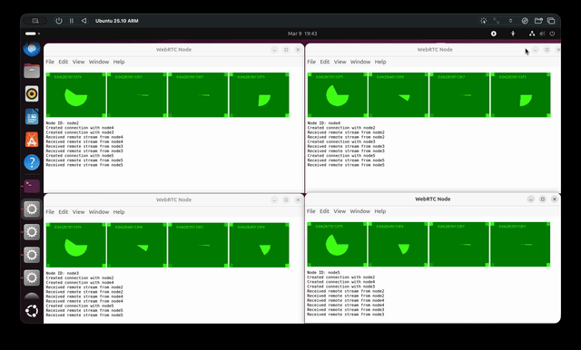

# WebRTC Electron Scaling Test

Simulate many-to-many WebRTC video conferences on an Electron app running on Linux using virtual network namespaces.

## Demo



## Usage

```
$ npm ci
$ node controller.js <number-of-nodes>
```

## Features

- Creates isolated nodes with configurable latency, packet loss, and bandwidth.
- Electron clients stream media between all nodes using WebRTC.

## License

MIT
