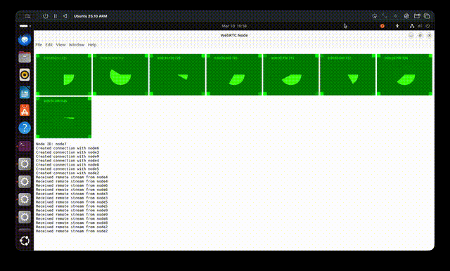

# WebRTC Electron Scaling Test

Simulate many-to-many WebRTC video conferences on an Electron app running on Linux using virtual network namespaces.

Observation: Playback seems ok for less than 8 clients but it becomes quite jittery with higher numbers.

## Demo


## Falls apart with 8 clients

On my setup, playback becomes quite jittery for 8 clients and higher.



## Usage

On Linux:

```
$ npm ci
$ node controller.js <number-of-nodes>
```

## Features

- Uses [`virtual-net`](https://github.com/RaisinTen/virtual-net) to create isolated nodes with configurable latency, packet loss, and bandwidth.
- Electron clients stream media between all nodes using WebRTC.

## License

MIT
